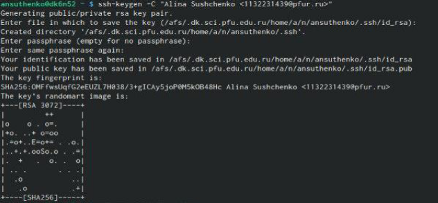
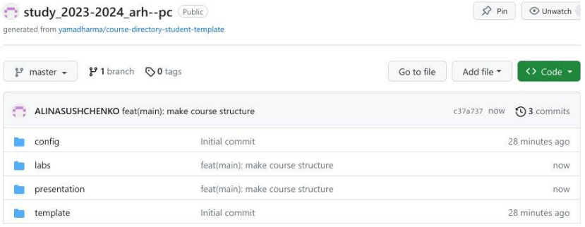

---
## Front matter
title: "Лабораторная работа No2. Система контроля
версий Git"
subtitle: "Архитектура Компьютера"
author: "Сущенко Алина Николаевна"

## Generic otions
lang: ru-RU
toc-title: "Содержание"

## Bibliography
bibliography: bib/cite.bib
csl: pandoc/csl/gost-r-7-0-5-2008-numeric.csl

## Pdf output format
toc: true # Table of contents
toc-depth: 2
lof: true # List of figures
lot: true # List of tables
fontsize: 12pt
linestretch: 1.5
papersize: a4
documentclass: scrreprt
## I18n polyglossia
polyglossia-lang:
  name: russian
  options:
	- spelling=modern
	- babelshorthands=true
polyglossia-otherlangs:
  name: english
## I18n babel
babel-lang: russian
babel-otherlangs: english
## Fonts
mainfont: PT Serif
romanfont: PT Serif
sansfont: PT Sans
monofont: PT Mono
mainfontoptions: Ligatures=TeX
romanfontoptions: Ligatures=TeX
sansfontoptions: Ligatures=TeX,Scale=MatchLowercase
monofontoptions: Scale=MatchLowercase,Scale=0.9
## Biblatex
biblatex: true
biblio-style: "gost-numeric"
biblatexoptions:
  - parentracker=true
  - backend=biber
  - hyperref=auto
  - language=auto
  - autolang=other*
  - citestyle=gost-numeric
## Pandoc-crossref LaTeX customization
figureTitle: "Рис."
tableTitle: "Таблица"
listingTitle: "Листинг"
lofTitle: "Список иллюстраций"
lotTitle: "Список таблиц"
lolTitle: "Листинги"
## Misc options
indent: true
header-includes:
  - \usepackage{indentfirst}
  - \usepackage{float} # keep figures where there are in the text
  - \floatplacement{figure}{H} # keep figures where there are in the text
---

# Цель работы

Изучить применение средств контроля версии.
Приобретения навыков работы с «git».

# Теоретическое введение

Системы контроля версий (Version Control System, VCS) применяются при работе
нескольких человек над одним проектом. Обычно основное дерево проекта хранится в
локальном или удалённом репозитории, к которому настроен доступ для участников про-
екта. При внесении изменений в содержание проекта система контроля версий позволяет
их фиксировать, совмещать изменения, произведённые разными участниками проекта,
производить откат к любой более ранней версии проекта, если это требуется.
В классических системах контроля версий используется централизованная модель, пред-
полагающая наличие единого репозитория для хранения файлов. Выполнение большинства
функций по управлению версиями осуществляется специальным сервером. Участник про-
екта (пользователь) перед началом работы посредством определённых команд получает
нужную ему версию файлов. После внесения изменений, пользователь размещает новую
версию в хранилище. При этом предыдущие версии не удаляются из центрального хранили-
ща и к ним можно вернуться в любой момент. Сервер может сохранять не полную версию
изменённых файлов, а производить так называемую дельта-компрессию — сохранять только
изменения между последовательными версиями, что позволяет уменьшить объём хранимых
данных.
Системы контроля версий поддерживают возможность отслеживания и разрешения кон-
фликтов, которые могут возникнуть при работе нескольких человек над одним файлом.
Можно объединить (слить) изменения, сделанные разными участниками (автоматически
или вручную), вручную выбрать нужную версию, отменить изменения вовсе или заблоки-
ровать файлы для изменения. В зависимости от настроек блокировка не позволяет другим
пользователям получить рабочую копию или препятствует изменению рабочей копии файла
средствами файловой системы ОС, обеспечивая таким образом, привилегированный доступ
только одному пользователю, работающему с файлом.
Системы контроля версий также могут обеспечивать дополнительные, более гибкие функ-
циональные возможности. Например, они могут поддерживать работу с несколькими вер-
сиями одного файла, сохраняя общую историю изменений до точки ветвления версий и
собственные истории изменений каждой ветви. Кроме того, обычно доступна информация
о том, кто из участников, когда и какие изменения вносил. Обычно такого рода информация
хранится в журнале изменений, доступ к которому можно ограничить.
В отличие от классических, в распределённых системах контроля версий центральный
репозиторий не является обязательным.
Среди классических VCS наиболее известны CVS, Subversion, а среди распределённых —
Git, Bazaar, Mercurial. Принципы их работы схожи, отличаются они в основном синтаксисом
используемых в работе команд

# Выполнение лабораторной работы

1. С помощью команды git config --global вводим в терминал владельца репозитория
имя и email 

{#fig:001 width=70%}

{#fig:002 width=70%}

{#fig:003 width=70%}

2. Используя команду ssh-keygen -C, генерируем ключи

{#fig:004 width=70%}

3. С помощью команды cat мы копируем из локальнои консоли ключ в буфер обмена

{#fig:005 width=70%}

{#fig:006 width=70%}

4. С помощью команды mkdir -р создаем каталог

{#fig:007 width=70%}

5. Переходим по ссылке указаннои в работе и создаем репозитории на основе шаблона,
выбрая «Use this template». В открывшемся окне задаем имя репозиторию
(study_2023-2024_archpc) и создаем репозитории и нажимаем «Create repository from
template».

{#fig:008 width=70%}

{#fig:009 width=70%}

{#fig:010 width=70%}

6. Удаляем лишние фаилы из каталога
 
{#fig:011 width=70%}

{#fig:012 width=70%}

{#fig:013 width=70%}

{#fig:014 width=70%}

{#fig:015 width=70%}

7. Копируем первую лабораторную из каталога «Загрузки» в каталог
«labs/lab01/report» 

{#fig:016 width=70%}

{#fig:017 width=70%}

{#fig:018 width=70%}

{#fig:019 width=70%}

# Выводы

Мы приобрели практические навыки по работе с системои git, а так же изучили
применение средств контроля версии.

# Список литературы{.unnumbered}

::: {#refs}
:::
# Задание

Здесь приводится описание задания в соответствии с рекомендациями
методического пособия и выданным вариантом.

# Теоретическое введение

Здесь описываются теоретические аспекты, связанные с выполнением работы.

Например, в табл. @tbl:std-dir приведено краткое описание стандартных каталогов Unix.

: Описание некоторых каталогов файловой системы GNU Linux {#tbl:std-dir}

| Имя каталога | Описание каталога                                                                                                          |
|--------------|----------------------------------------------------------------------------------------------------------------------------|
| `/`          | Корневая директория, содержащая всю файловую                                                                               |
| `/bin `      | Основные системные утилиты, необходимые как в однопользовательском режиме, так и при обычной работе всем пользователям     |
| `/etc`       | Общесистемные конфигурационные файлы и файлы конфигурации установленных программ                                           |
| `/home`      | Содержит домашние директории пользователей, которые, в свою очередь, содержат персональные настройки и данные пользователя |
| `/media`     | Точки монтирования для сменных носителей                                                                                   |
| `/root`      | Домашняя директория пользователя  `root`                                                                                   |
| `/tmp`       | Временные файлы                                                                                                            |
| `/usr`       | Вторичная иерархия для данных пользователя                                                                                 |

Более подробно об Unix см. в [@gnu-doc:bash;@newham:2005:bash;@zarrelli:2017:bash;@robbins:2013:bash;@tannenbaum:arch-pc:ru;@tannenbaum:modern-os:ru].

# Выполнение лабораторной работы

Описываются проведённые действия, в качестве иллюстрации даётся ссылка на иллюстрацию (рис. @fig:001).

{#fig:001 width=70%}

# Выводы

Здесь кратко описываются итоги проделанной работы.

# Список литературы{.unnumbered}

::: {#refs}
:::
