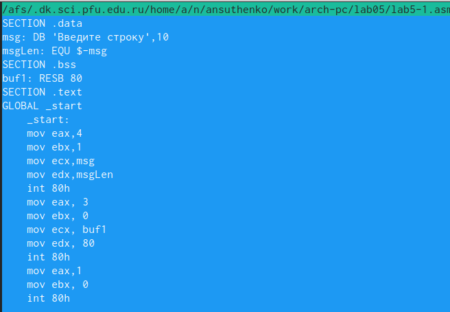
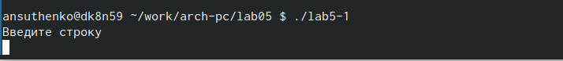

---
## Front matter
title: "Лабораторная работа No5. Основы работы с
Midnight Commander (mc). Структура программы на
языке ассемблера NASM. Системные вызовы в ОС
GNU Linux"
subtitle: "Дисциплина : архитектура компьютера"
author: "Сущенко Алина Николаевна"

## Generic otions
lang: ru-RU
toc-title: "Содержание"

## Bibliography
bibliography: bib/cite.bib
csl: pandoc/csl/gost-r-7-0-5-2008-numeric.csl

## Pdf output format
toc: true # Table of contents
toc-depth: 2
lof: true # List of figures
lot: true # List of tables
fontsize: 12pt
linestretch: 1.5
papersize: a4
documentclass: scrreprt
## I18n polyglossia
polyglossia-lang:
  name: russian
  options:
	- spelling=modern
	- babelshorthands=true
polyglossia-otherlangs:
  name: english
## I18n babel
babel-lang: russian
babel-otherlangs: english
## Fonts
mainfont: PT Serif
romanfont: PT Serif
sansfont: PT Sans
monofont: PT Mono
mainfontoptions: Ligatures=TeX
romanfontoptions: Ligatures=TeX
sansfontoptions: Ligatures=TeX,Scale=MatchLowercase
monofontoptions: Scale=MatchLowercase,Scale=0.9
## Biblatex
biblatex: true
biblio-style: "gost-numeric"
biblatexoptions:
  - parentracker=true
  - backend=biber
  - hyperref=auto
  - language=auto
  - autolang=other*
  - citestyle=gost-numeric
## Pandoc-crossref LaTeX customization
figureTitle: "Рис."
tableTitle: "Таблица"
listingTitle: "Листинг"
lofTitle: "Список иллюстраций"
lotTitle: "Список таблиц"
lolTitle: "Листинги"
## Misc options
indent: true
header-includes:
  - \usepackage{indentfirst}
  - \usepackage{float} # keep figures where there are in the text
  - \floatplacement{figure}{H} # keep figures where there are in the text
---
#Задания
1. Откройте Midnight Commander
2. Создать папку lab05
3. Создать файл "lab5-1.asm" ,оттранслировать текст программы, скомпонировать объектны файл, после чего запустить полученный файл.
4. Сказать файл с ТУИС и скопировать в каталог lab05.
5. Скопировать файлы "lab5-1.asm", переименовать в "lab5-2.asm" и переделать текст программы так, чтобы использовалась программа из скаченного файла с ТУИС.
6. Создать файл и проверить его работу.
7. Создать копию файла "lab5-1.asm". Изменить текст программы так, чтобы не был использован внешний файл  "in_out.asm", но при этом сохранять последовательность действий по алгоритму.
8. Создать копию "lab5-2.asm", изменить текст программы( с использованием файла in_out.asm),так же припридерживась алгоритма.
9. Создать файлы соответсвующие условию заданий и проверить из работу.
# Цель работы

Приобретение практических навыков работы в Midnight Commander. Освоение инструкций
языка ассемблера mov и int.

# Выполнение лабораторной работы

# 1. Откройте MC.
	Открываем midnight commander с помощью команты 'mc' (рис.1 [fig:001 width=70%]) , (рис.2 [fig:002 width=70%]) 

{#fig:001 width=70%}

{#fig:002 width=70%}

2. Используя клавиши на клавиатуре переходим в нужный нам каталог и наживаем 'enter' (рис.3 [fig:003 width=70%]) .

{#fig:003 width=70%}

4. С помощью клавиши 'F7' создаем папку 'lab05' и переходим в неё (рис.4 [fig:004 width=70%]) , (рис.5 [fig:005 width=70%])

{#fig:004 width=70%}

{#fig:005 width=70%}

5. С помощью команды 'touch' создаём файл 'lab5-1.asm' и проверяем его наличие (рис.6 [fig:006 width=70%]) , (рис.7 [fig:007 width=70%])

{#fig:006 width=70%}

{#fig:007 width=70%}

6. С помощью клавиши 'F4' переходим в редактирование файла и вставляем текст программы предложенном на ТУИС. 

Текст программы имеет вид: 
SECTION .data
msg: DB 'Введите строку:',10
msgLen: EQU $-msg
SECTION .bss
13
buf1: RESB 80
SECTION .text
GLOBAL _start
_start:
mov eax,4
mov ebx,1
mov ecx,msg
mov edx,msgLen
int 80h
mov eax, 3
mov ebx, 0
mov ecx, buf1
mov edx, 80
int 80h
mov eax,1
mov ebx,0
int 80h

( рис.8 [fig:008 width=70%])

{#fig:008 width=70%}

7. С помощью клавиши 'F2' сохраняем проделанные изменения и просматривем результат с помощью клавиши 'F3' ( рис.9 [fig:009 width=70%])

{#fig:009 width=70%}

8. Транслируем текст программы в объектный файл, компилируем начальный файл и передаём объектный файл на обработку компоновщику ( рис.10 [fig:010 width=70%]), ( рис.11 [fig:011 width=70%]), ( рис.12 [fig:012 width=70%]) 

{#fig:010 width=70%}

{#fig:011 width=70%}

{#fig:012 width=70%}

9. Пробуем запустить созданный файл. ( рис.13 [fig:013 width=70%])

{#fig:013 width=70%}

10. Ввод фамилии в строке. ( рис.14 [fig:014 width=70%])

{#fig:014 width=70%}

# 2. Подключение внешнего файла in_out.asm

1. Скачиваем файл in_out.asm с ТУИС и для удобства открываем его в соседнем каталоге ( рис.15 [fig:015 width=70%])

{#fig:015 width=70%}

2. Используя клавишу 'F5' копируем файл in_out.asm в тот же каталог с нашим файлом ( рис.16 [fig:016 width=70%])

{#fig:016 width=70%}

3. С помощью той же клавиши создаём копию файла 'lab5-1.asm' с именем 'lab5-2.asm' 

Текст программы имеет вид:
%include 'in_out.asm'
SECTION .data
msg: DB 'Введите строку:',10
SECTION .bss
buf1: RESB 80
SECTION .text
GLOBAL _start
22
_start:
mov eax, msg
call sprintLF
mov ecx, buf1
mov edx, 80
call sread
call quit

( рис.17 [fig:017 width=70%]) , ( рис.18 [fig:018 width=70%]) , ( рис.19 [fig:019 width=70%])

{#fig:017 width=70%}

{#fig:018 width=70%}

{#fig:019 width=70%}

4. Транслируем текст программы (скрины не сохранились) в объектный файл и выполняем компановку объектного файла, после чего производим запуск программы. ( рис.20 [fig:020 width=70%]) , ( рис.21 [fig:021 width=70%])

{#fig:020 width=70%}

{#fig:021 width=70%}

5. Меняем в файле 'lab5-2.asm' 'sprintLF' на 'sprint' 

Текст программы выглядит так: 
%include 'in_out.asm'
SECTION .data
msg: DB 'Введите строку:',10
SECTION .bss
buf1: RESB 80
SECTION .text
GLOBAL _start
_start:
mov eax, msg
call sprint
mov ecx, buf1
mov edx, 80
call sread
call quit

( рис.22 [fig:022 width=70%])

{#fig:022 width=70%} 

6. Создаём исполняемый файл и проверяем его работу и порверяем его работу ( рис.23 [fig:023 width=70%])

{#fig:023 width=70%}

В файле lab5-2.asm замените подпрограмму sprintLF на sprint. Создайте исполняе-
мый файл и проверьте его работу. В чем разница?

Разница в том, что в первом случае ввод текста с клавиатуры производится на следующей строке, а во втором - сразу после двоеточия.

#Задание для самостоятельной работы

1. Создаём копию файла 'lab5-1.asm' с новым именем 'lab5-1-1.asm' ( рис.24 [fig:024 width=70%])

{#fig:024 width=70%}

2. Без использования программы in_out.asm вносим изменения в программу, чтобы она работала по заданному алгоритму: 1)Вывести приглашение типа "Введите строку";2)Вывести строку с клавиатуры;3)Вывести введённую строку на экран  (рис.24-1 [fig:025 width=70%])
Текст программы:
SECTION .data
msg: DB 'Введите строку:',10
msgLen: EQU $-msg
SECTION .bss
buf1: RESB 80
SECTION .text
GLOBAL _start
_start:
mov eax,4
mov ebx,1
mov ecx,msg
mov edx,msgLen
int 80h
mov eax, 3
mov ebx, 0
mov ecx, buf1
mov edx, 80
int 80h
mov eax,1
mov ebx,0
int 80h

{#fig:025 width=70%}

3. Получаем исполняемый файл, проверяем работу. Вводим свою фамилию и имя (рис.26 [fig:026 width=70%])

{#fig:026 width=70%} 

4. Создаём копию файла 'lab5-2.asm' и переименовываем копию 'lab5-2-2.asm' (рис.27 [fig:027 width=70%])

{#fig:027 width=70%}

5. Вносим изменения в изначальный код, чтобы она работала по алгоритму:1) Вывести приглашение "Ввести строку:";2)Вывести строку с клавиатуры;3)Вывести введённую строку на экран 

Текст программы:
%include 'in_out.asm'
SECTION .data
msg: DB 'Введите строку:',10
SECTION .bss
buf1: RESB 80
SECTION .text
GLOBAL _start
_start:
mov eax, msg
call sprint
mov ecx, buf1
mov edx, 80
call sread
mov eax,4
mov ebx,1
mov ecx,buf1
int 80h
call quit

(рис.27-1 [fig:028 width=70%])

{#fig:028 width=70%}

6. Создаем файл и заставляем его работать. (рис.28 [fig:029 width=70%])

{#fig:029 width=70%}

# Выводы

В ходе выполнения этой работы мы приобрели навыки работы в МС, а так же освоили инструкции языка ассемблера mov и int.

