---
## Front matter
title: "Лабораторная работа No6. Арифметические
операции в NASM."
subtitle: "Архитектура компьтера"
author: "Сущенко Алина Николаевна"

## Generic otions
lang: ru-RU
toc-title: "Содержание"

## Bibliography
bibliography: bib/cite.bib
csl: pandoc/csl/gost-r-7-0-5-2008-numeric.csl

## Pdf output format
toc: true # Table of contents
toc-depth: 2
lof: true # List of figures
lot: true # List of tables
fontsize: 12pt
linestretch: 1.5
papersize: a4
documentclass: scrreprt
## I18n polyglossia
polyglossia-lang:
  name: russian
  options:
	- spelling=modern
	- babelshorthands=true
polyglossia-otherlangs:
  name: english
## I18n babel
babel-lang: russian
babel-otherlangs: english
## Fonts
mainfont: PT Serif
romanfont: PT Serif
sansfont: PT Sans
monofont: PT Mono
mainfontoptions: Ligatures=TeX
romanfontoptions: Ligatures=TeX
sansfontoptions: Ligatures=TeX,Scale=MatchLowercase
monofontoptions: Scale=MatchLowercase,Scale=0.9
## Biblatex
biblatex: true
biblio-style: "gost-numeric"
biblatexoptions:
  - parentracker=true
  - backend=biber
  - hyperref=auto
  - language=auto
  - autolang=other*
  - citestyle=gost-numeric
## Pandoc-crossref LaTeX customization
figureTitle: "Рис."
tableTitle: "Таблица"
listingTitle: "Листинг"
lofTitle: "Список иллюстраций"
lotTitle: "Список таблиц"
lolTitle: "Листинги"
## Misc options
indent: true
header-includes:
  - \usepackage{indentfirst}
  - \usepackage{float} # keep figures where there are in the text
  - \floatplacement{figure}{H} # keep figures where there are in the text
---

# Цель работы

Освоение арифметических инструкций языка ассемблера NASM.

# Задание

1. Выводим значение регистра.
2. Выводим другое значение регистра с ответом на вопросы.
3. С помощью команды вычисляем значение выражения.
4. Выводим с помощью программмы номер студенческого билета с ответом на вопрос.
5. Решаем заданный вариант с помощью изученных программ.

# Выполнение лабораторной работы

subtitle:"Символьные и численные данные NASM"

1. Создаём директорий и файл типа .asm в нём (рис.1 [fig:001 width=70%]),(рис.2 [fig:002 width=70%]).

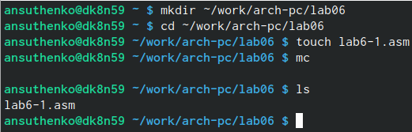{#fig:001 width=70%}

2. Перенос in-out.asm в наш директорий.

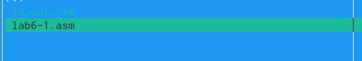{#fig:002 width=70%}

3. Вводим текст команды для вывода символа (рис.3 [fig:003 width=70%])

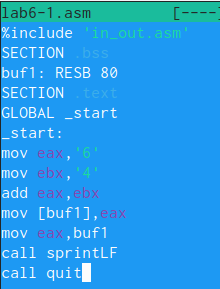{#fig:003 width=70%}

4. Создаём исполняемый файл и запускаем работу (рис.4 [fig:004 width=70%]).

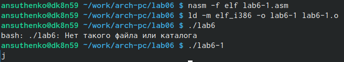{#fig:004 width=70%}

Программа вывела симвод "j" потому что в соотвествии с системой ASCII мы вывели числа 4 и 6 и сложили.

5. Чуть изменим текст программы и запишем регистры вместо символов. (рис.5 [fig:005 width=70%])

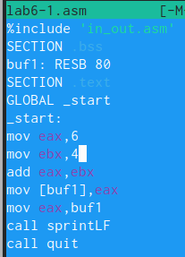{#fig:005 width=70%}

6. Создадим исполняемый файл и запустим его работу (рис.6 [fig:006 width=70%])

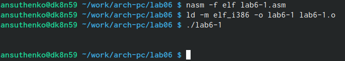{#fig:006 width=70%}

На данном этапе выводится символ с кодом 10, а именно символ переноса строки. Он не отображается при выводе на экран.

7. Создадим ещё один файл .asm (рис.7 [fig:007 width=70%])

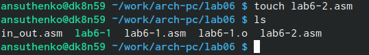{#fig:007 width=70%}

8. Введем код  программы для вывода значения eax (рис.8 [fig:008 width=70%])

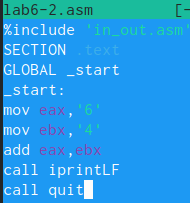{#fig:008 width=70%}

9. Содаём исполняемый файл и запускаем работу. (рис.9 [fig:009 width=70%])

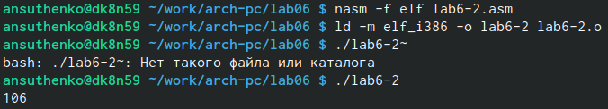{#fig:009 width=70%}

В результате работы получаем число 106. Команда сложила коды символов 6 и 4, а именно 54+52. Однако в отличие от программы, которую мы используем в 6.1, функция iprintLF выводит число, а не символ закодированный этим числом.

10. Заменяем кусочек кода в исходно программе. (рис.10 [fig:010 width=70%]).

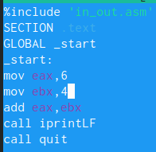{#fig:010 width=70%}

11. Запускаем исполняемый файл. (рис.11 [fig:011 width=70%])

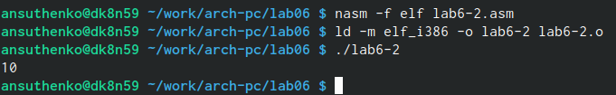{#fig:011 width=70%}

Программа сложила просто числа 4 и 6, поэтому и вывело 10.

12. Заменяем iprintLf на iprint (рис.12 [fig:012 width=70%]).

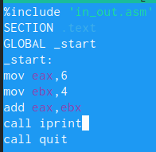{#fig:012 width=70%}

13. Запускаем исполняемый файл (рис.13 [fig:013 width=70%]).

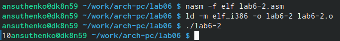{#fig:013 width=70%}

В результате не было изменения, кроме отстусвия переноса строки.

subtitle:"Выполнение аримфметических операций в NASM"

1. Создаём файл lab6-3.asm и вводим в созданный файл текст программы для вычисления значений выражения f(𝑥) = (5 ∗ 2 + 3)/3 (рис.14 [fig:014 width=70%])

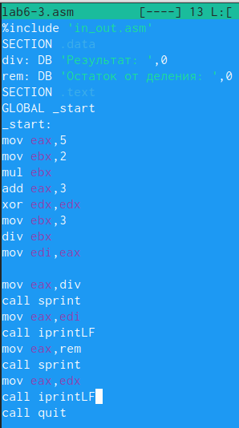{#fig:014 width=70%}

2. Запускаем исполняемый файл. (рис.15 [fig:015 width=70%])

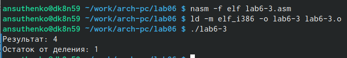{#fig:015 width=70%}

3. Заменяем программу так, чтобы оно решало выражение f(𝑥) = (4 ∗ 6 + 2)/5 (рис.16 [fig:016 width=70%])

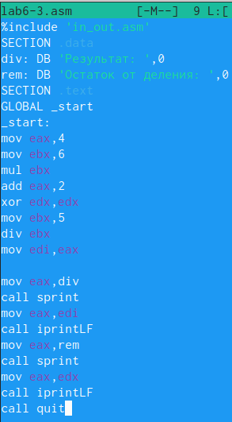{#fig:016 width=70%}

4. Создаём файл и запускаем его работу. (рис.17 [fig:017 width=70%])

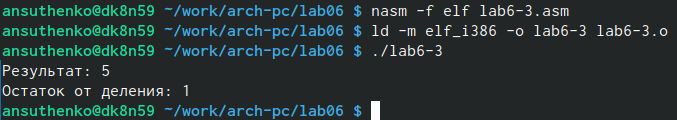{#fig:017 width=70%}

5. Создадим файл variant.asm и вычислим номер варианта (рис.18 [fig:018 width=70%])

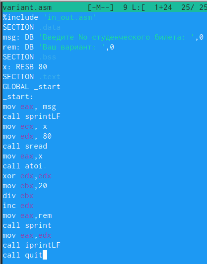{#fig:018 width=70%}

6. Запуск исполняемого файла (рис.19 [fig:019 width=70%])

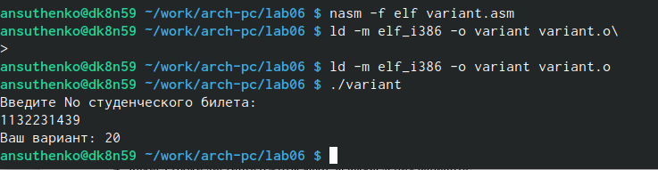{#fig:019 width=70%}

subtitle: Ответы на вопросы.

1. Строки листинга 6.4 отвечающие за вывод строки кода:
mov eax,rem
call sprint

2. Инструкция mov ecx, x используется для прокладывания пути к вводимой строке mov ecx. mov edx, 80 используется для записи в регистр edx(длина строки). call sread используется для вызова попрограммы внешнего файла, чтобы вывести сообщение с клавиатуры.

3. Инструкция call atoi нужна для вызова подпрограммы из внешнего файла для считывания кода ASCII и перевода его в числовое значение, после чего идёт запись в регистр eax

4. За вычисления варианта отвечают строки :
xor edx,edx ;облуление edx для корректной работы div
mov ebx,2   ;ebx=2
div ebx     ;eax=eax/2 ,edx -остаток от делания
inc edx     ;edx=edx+1

5. При выполнении функции div ebx остаток от делания идёт в регистр edx.

6. inc edx увеличивает значение edx на 1.

7. Отвечают за вывод на экран результата вычислений сторки:
mov eax,edx
call inprintLF

subtitle: Выполнение задания для самостоятельной работы.

1. Создаём файл lab6-4.asm и пишем код программы.(рис.20 [fig:020 width=70%])

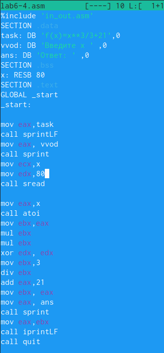{#fig:020 width=70%}

 
 2. Проверяем работу программы (рис.20 [fig:020 width=70%])
 
 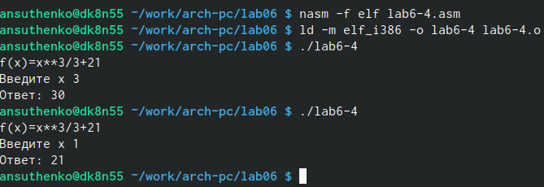{#fig:021 width=70%}
 
# Выводы

Выполняя эту работу мы освоили арифметические инстрекции языка ассемблер NASM.

# Список литературы{.unnumbered}

::: {#refs}
:::
