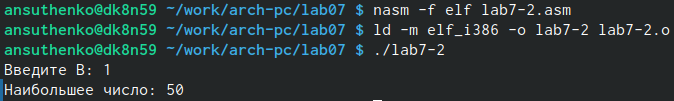
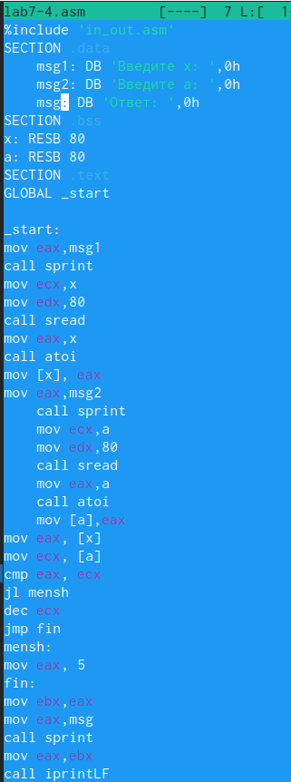

---
## Front matter
title: "Лабораторная работа No7. Команды безусловного и
условного переходов в Nasm. Программирование
ветвлений."
subtitle: "Дисциплина: Архитектура Копмьютера"
author: "Сущенко Алина Николаевна"

## Generic otions
lang: ru-RU
toc-title: "Содержание"

## Bibliography
bibliography: bib/cite.bib
csl: pandoc/csl/gost-r-7-0-5-2008-numeric.csl

## Pdf output format
toc: true # Table of contents
toc-depth: 2
lof: true # List of figures
lot: true # List of tables
fontsize: 12pt
linestretch: 1.5
papersize: a4
documentclass: scrreprt
## I18n polyglossia
polyglossia-lang:
  name: russian
  options:
	- spelling=modern
	- babelshorthands=true
polyglossia-otherlangs:
  name: english
## I18n babel
babel-lang: russian
babel-otherlangs: english
## Fonts
mainfont: PT Serif
romanfont: PT Serif
sansfont: PT Sans
monofont: PT Mono
mainfontoptions: Ligatures=TeX
romanfontoptions: Ligatures=TeX
sansfontoptions: Ligatures=TeX,Scale=MatchLowercase
monofontoptions: Scale=MatchLowercase,Scale=0.9
## Biblatex
biblatex: true
biblio-style: "gost-numeric"
biblatexoptions:
  - parentracker=true
  - backend=biber
  - hyperref=auto
  - language=auto
  - autolang=other*
  - citestyle=gost-numeric
## Pandoc-crossref LaTeX customization
figureTitle: "Рис."
tableTitle: "Таблица"
listingTitle: "Листинг"
lofTitle: "Список иллюстраций"
lotTitle: "Список таблиц"
lolTitle: "Листинги"
## Misc options
indent: true
header-includes:
  - \usepackage{indentfirst}
  - \usepackage{float} # keep figures where there are in the text
  - \floatplacement{figure}{H} # keep figures where there are in the text
---

# Цель работы

Изучение команд условного и безусловного переходов. Приобретение навыков написания
программ с использованием переходов. Знакомство с назначением и структурой файла
листинга.

# Выполнение лабораторной работы

#1.Реализация переходов в NASM

1. Создаём каталог для программ и проверяем его наличие.

{#fig:001 width=70%}

{#fig:002 width=70%}

2. Проверим работу программмы с использованием инструкции jmp.

{#fig:003 width=70%}

{#fig:004 width=70%}

3. Изменим текст программы файла 7-1.

{#fig:005 width=70%}

 
 Создадим исполняемый файл и запустим програму.

{#fig:006 width=70%}

4. В соответствии с заданием заменяем исходный код на новый, чтобы программа выводила сообщения от 3 до 1.

{#fig:007 width=70%}

Создадим исполняемый файл и запустим программу.

{#fig:008 width=70%}

5. Создаем файл lab7-1.asm и вводим текст программы.

{#fig:009 width=70%}

Создаём исполняемый файл и запускаем программу.

{#fig:010 width=70%}

#2.Изучение структуры файлы листинга

1. Создаем файл листинга для программы из файла lab7-2.asm.

{#fig:011 width=70%}

2. С помощью команды mcedit открываем файл lab7-2.lst

{#fig:012 width=70%}

#Опишем содержимое трёх строк файла по выбору.
1. Строчка 5. Адрес 00000001 ,он начинается по смещению соответствующему его номеру в сегменте кода.89С3 машинный код, mov ebx,eax(текст программы в котором мы ввводим ячейки).
2. Строчка 11. Адрес 00000009, он начинается по смещению соответствующему его номеру в сегменте кода. EBF8 машинный код, jmp nextchar (текст программы в котором мы переходим к следующей переменной).
3. Сторчка 17. Адрес 000000F2 н начинается по смещению соответствующему его номеру в сегменте кода. B9[0A000000] машинный код, move ecx,B (текст программы в котором мы помещаем значение,хранящееся в B в ecx).

3. Намеренно удаляем один операнд в коде. Нам выводит ошибку.

{#fig:013 width=70%}

4. С помощью команды "mcedit lab7-2.lst" в коде ищем где программа пишет ошибку.

{#fig:014 width=70%}

title:Задания для самостоятельнй работы.
subtitle:Первое задание

1. Создаём файл типа .asm 7-3 и переходим к редактированию.

{#fig:015 width=70%}

2. Пишем текст программы который должен найти меньшее из трёх чисел.

{#fig:016 width=70%}

3. Создаём исполняемый файл и запускаем его работу.

{#fig:017 width=70%}

subtitle:Листинг программы

section .data
msg1 db 'Введите A: ',0h
msg2 db 'Введите B: ',0h
msg3 db 'Введите C: ',0h
msg4 db "Наименьшее число: ",0h
section .bss
min resb 10
A resb 10
B resb 10
C resb 10
section .text
global _start
_start:

mov eax,msg1
call sprint

mov ecx,A
mov edx,10
call sread

mov eax,A
call atoi 
mov [A],eax

mov eax,msg2
call sprint

mov ecx,B
mov edx,10
call sread

mov eax,B
call atoi
mov [B],eax

mov eax,msg3
call sprint

mov ecx,C
mov edx,10
call sread

mov eax,C
call atoi
mov [C],eax

mov ecx,[A]
mov [min],ecx

cmp ecx,[C]
jl check_B
mov ecx,[C] 
mov [min],ecx

check_B:
	mov ecx,[min]
	cmp ecx,[B]
	jl fin
	mov ecx,[B]
	mov [min],ecx

fin:
	mov eax, msg4
	call sprint
	mov eax,[min]
	call iprintLF
	call quit
 
subtitle:Второе задание.

1. Создадим файл lab7-4.asm с помощью touch и проверим её наличие.

{#fig:018 width=70%}

{#fig:018 width=70%}

2. Напишем текст программы для функции в 20 варианте.

{#fig:020 width=70%}

3. Создадим исполняемый файл и запустим его работу. Убеждаемся в правильности его работы.

{#fig:021 width=70%} 

subtitle:Листинг программы 2.

%include 'in_out.asm'
SECTION .data
    msg1: DB 'Введите x: ',0h
    msg2: DB 'Введите a: ',0h
    msg: DB 'Ответ: ',0h
SECTION .bss
x: RESB 80
a: RESB 80
SECTION .text
GLOBAL _start

_start:
mov eax,msg1
call sprint
mov ecx,x
mov edx,80
call sread
mov eax,x
call atoi
mov [x], eax
mov eax,msg2
    call sprint
    mov ecx,a
    mov edx,80
    call sread
    mov eax,a
    call atoi
    mov [a],eax
mov eax, [x]
mov ecx, [a]
cmp eax, ecx
jl mensh
dec ecx
jmp fin
mensh:
mov eax, 5
fin:
mov ebx,eax
mov eax,msg
call sprint
mov eax,ebx
call iprintLF
call quit

# Выводы

В ходе выполнения лабораторной работы мы изучили назначение и структуру файла листинга, попробовали изучить переходы, а также написали программмы с использованием новых навыков.

