---
## Front matter
title: "Лабораторная работа No8. Программирование
цикла. Обработка аргументов командной строки."
subtitle: "Дисциплина : Архитектура Копмьютера"
author: "Сущенко Алина Николавена"

## Generic otions
lang: ru-RU
toc-title: "Содержание"

## Bibliography
bibliography: bib/cite.bib
csl: pandoc/csl/gost-r-7-0-5-2008-numeric.csl

## Pdf output format
toc: true # Table of contents
toc-depth: 2
lof: true # List of figures
lot: true # List of tables
fontsize: 12pt
linestretch: 1.5
papersize: a4
documentclass: scrreprt
## I18n polyglossia
polyglossia-lang:
  name: russian
  options:
	- spelling=modern
	- babelshorthands=true
polyglossia-otherlangs:
  name: english
## I18n babel
babel-lang: russian
babel-otherlangs: english
## Fonts
mainfont: PT Serif
romanfont: PT Serif
sansfont: PT Sans
monofont: PT Mono
mainfontoptions: Ligatures=TeX
romanfontoptions: Ligatures=TeX
sansfontoptions: Ligatures=TeX,Scale=MatchLowercase
monofontoptions: Scale=MatchLowercase,Scale=0.9
## Biblatex
biblatex: true
biblio-style: "gost-numeric"
biblatexoptions:
  - parentracker=true
  - backend=biber
  - hyperref=auto
  - language=auto
  - autolang=other*
  - citestyle=gost-numeric
## Pandoc-crossref LaTeX customization
figureTitle: "Рис."
tableTitle: "Таблица"
listingTitle: "Листинг"
lofTitle: "Список иллюстраций"
lotTitle: "Список таблиц"
lolTitle: "Листинги"
## Misc options
indent: true
header-includes:
  - \usepackage{indentfirst}
  - \usepackage{float} # keep figures where there are in the text
  - \floatplacement{figure}{H} # keep figures where there are in the text
---

# Цель работы

Приобретение навыков написания программ с использованием циклов и обработкой
аргументов командной строки.

# Выполнение лабораторной работы

# Реализация циклов в NASM

1. Создаём каталог программы и создаём файл lab8-1.asm. Переносим в lab08 файл 'in_out_asm'

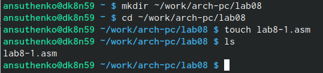{#fig:001 width=70%}

{#fig:002 width=70%}

2. Вводим текст программы.

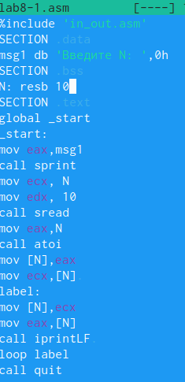{#fig:003 width=70%}

3. Создаём исполняемый файл и запускаем работу.

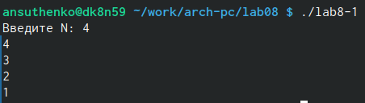{#fig:004 width=70%}

4. Заменяем часть текста программы.

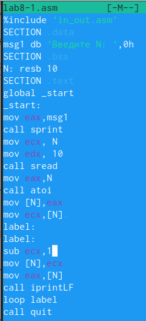{#fig:005 width=70%}

5. Создаём исполняемый файл и запускаем работу.

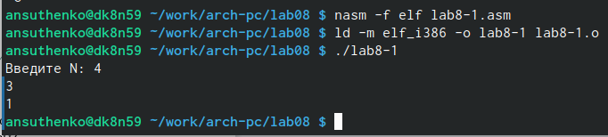{#fig:006 width=70%} 

"Ошибка" в программе вывела на запрос "4" только числа 1 и 3. Ошибка заключается в том, что данная программы выводит только нечётные значения.

1. Вводим текст программы.

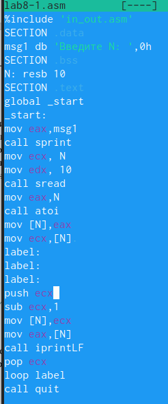{#fig:007 width=70%} 

2. Запускаем программу.

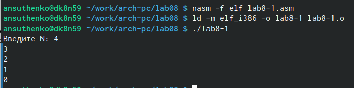{#fig:008 width=70%} 

Нам вывело 4 числа от 0 до 3. 

#Обработка аргументов командной строки
1. Создаём файл 8-2.asm и вводим в него код программы.

 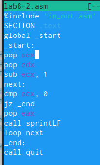{#fig:009 width=70%}
 
2. Запускаем работу программы в соответсвии с требованиями.

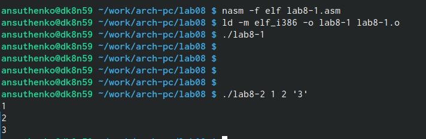{#fig:010 width=70%} 

3. Вводим текст программы который выбирает большее число из ряда чисел.

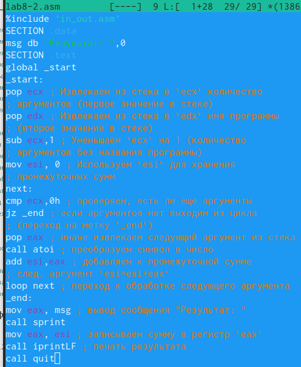{#fig:011 width=70%}

4. Запускаем программу.

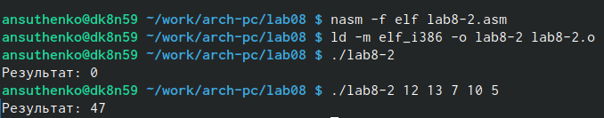{#fig:012 width=70%} 

title: Задания для самостоятельной работы.
# Задание 1.
1. Напишем текст программмы для функции 3(10+х).

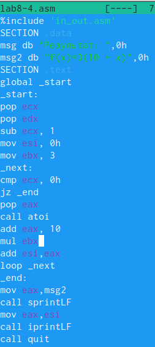{#fig:013 width=70%}

2. Запускакем работу программы.

{#fig:012 width=70%}

#Листинг программы.

%include 'in_out.asm'
SECTION .data
msg db "Результат: ",0h
msg2 db "f(x)=3(10 + 𝑥)",0h
SECTION .text
global _start
_start:
pop ecx
pop edx
sub ecx, 1
mov esi, 0h
mov ebx, 3
_next:
cmp ecx, 0h
jz _end
pop eax
call atoi
add eax, 10
mul ebx
add esi,eax
loop _next
_end:
mov eax,msg2
call sprintLF
mov eax,esi
call iprintLF
call quit

# Выводы

Мы научились работать с циклами и освоили организацию циклов.

# Список литературы{.unnumbered}

::: {#refs}
:::
